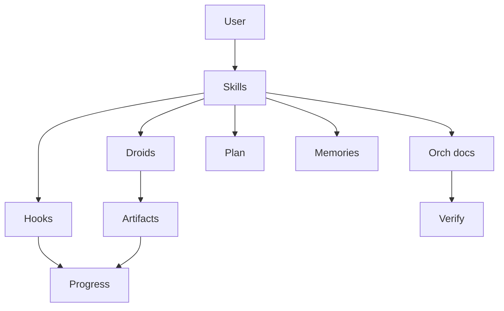
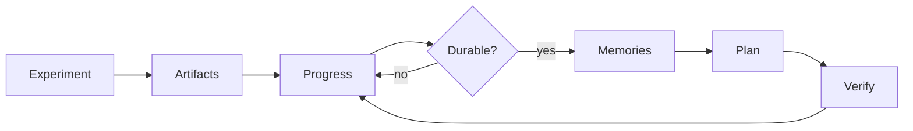

# TPU Orchestration Control Plane

**Version:** v2 (2026-05-13)
**Purpose:** unify skills, droids, hooks, memory files, orchestration
specs, and runtime artifacts for TinyAya Stage 2 TPU work.

Current durable milestone: iter 24h remains the protected fallback
baseline, while `opt-prod5k` is the promoted optimized production
checkpoint. Phase 4 activation/depth candidates are now compared
against `opt-prod5k` before promotion.

## 1. Entry points

| User intent | Primary entry point | Supporting files |
|---|---|---|
| Load state before non-trivial work | `keep-context-fresh` / `recall-context` | `PLAN.md`, `PROGRESS.md`, `VERIFY.md`, `memories.md`, this file |
| Run or supervise TPU training | `tpu-orchestrate` | `SPEC.md`, playbooks, `tpu-watchdog`, `tpu-diagnoser` |
| Optimize TPU throughput | `tpu-orchestrate` in optimization mode | `TPU_OPTIMIZATION_SPEC.md`, experiment matrix, perf schema |
| Hot redeploy to active TPU | `tpu-redeploy` | `_remote_redeploy.sh`, `_artifacts/orch_state.json` |
| Record phase/task state | `update-plan` | `.factory/PLAN.md` |
| Record chronological events | `update-progress` / hooks | `.factory/PROGRESS.md` |
| Prove done | `verify` / Stop hook | `.factory/VERIFY.md` |

There is one master TPU run-control skill: **`tpu-orchestrate`**. It
selects either self-healing run mode (`SPEC.md`) or optimization mode
(`TPU_OPTIMIZATION_SPEC.md`) based on the user goal.

## 2. Source-of-truth boundaries

| Surface | Owns | Does not own |
|---|---|---|
| `.factory/PLAN.md` | Current goal, phase checklist, Definition of Done | Full run history or raw logs |
| `.factory/PROGRESS.md` | Append-only event log, verify results, pass/fail summaries | Durable architecture rationale |
| `.factory/memories.md` | Durable decisions, gotchas, validated milestones | Step-by-step task lists |
| `.factory/VERIFY.md` | Commands that prove the repo/memory system is sane | Experiment hypotheses |
| `.factory/orchestration/*.md` | Operational specs, playbooks, run-control rules | Raw TPU runtime data |
| `_artifacts/*` | Ephemeral logs, profiles, poller state, scratch reports | Canonical memory |
| W&B/GCS | External metrics, profiles, checkpoints | Repo-local source of truth |

Rule: write a fact once at the most specific durable layer, then link or
summarize elsewhere.

## 3. Control-plane diagram

See `diagrams/07-control-plane.mmd`.

## 4. Skill responsibilities

### `tpu-orchestrate`

Master skill for TPU run control. It must:

1. Read this file first for TPU work.
2. Read `SPEC.md` for self-healing run supervision.
3. Read `TPU_OPTIMIZATION_SPEC.md` for throughput optimization.
4. Use `tpu-watchdog` for live state.
5. Use `tpu-diagnoser` for crash, stall, or regression classification.
6. Use `tpu-redeploy` only after approved patches.
7. Write outcomes to the correct memory surface.

### `tpu-redeploy`

Subordinate deployment procedure. It does not choose optimization
experiments; it only redeploys the already-selected state to an active
TPU QR and updates ephemeral orchestrator state.

### `keep-context-fresh` and `recall-context`

These are context loaders. For TPU work they must include this file and
the relevant orchestration spec in addition to the four canonical memory
files.

### `update-plan`, `update-progress`, `verify`, `archive-progress`

These remain memory-maintenance skills. They do not decide TPU
experiments. They keep the active checklist, event log, verification
state, and log size under control.

## 5. Droid responsibilities

| Droid | Mode | Responsibility |
|---|---|---|
| `tpu-watchdog` | read-only | Return topology-aware run state, log tail, TPU/HBM/PID/W&B data, and optional optimization metrics. |
| `tpu-diagnoser` | read-only | Classify failures or optimization regressions and recommend tiered action. |

Droids never edit files, restart TPU processes, or recreate queued
resources. They return structured JSON to the master skill.

## 6. Hook responsibilities

| Hook | Role |
|---|---|
| `SessionStart` | Inject memory files, AGENTS instructions, and orchestration control-plane excerpts into context. |
| `UserPromptSubmit` | Capture `#progress`, `#plan`, `#decision`, and `#verify` quick entries. |
| `PostToolUse` | Append progress entries after meaningful edits or non-trivial execution. |
| `Stop` | Run a bounded verify subset and log pass/fail. |
| `PreCompact` | Snapshot open PLAN items before compaction. |
| `SessionEnd` | Carry open PLAN items into the next session. |

Hooks are automation glue, not the source of operational policy. The
policy lives in this folder.

## 7. Memory lifecycle

See `diagrams/08-memory-lifecycle.mmd`.

Lifecycle:

1. Raw logs and profiles land in `_artifacts/`, W&B, or GCS.
2. The orchestrator summarizes events into `PROGRESS.md`.
3. Only validated decisions or gotchas graduate to `memories.md`.
4. Active follow-up work is represented in `PLAN.md`.
5. `VERIFY.md` proves repository and orchestration integrity.

## 8. TPU optimization memory rules

For each candidate:

1. Add or update a `PLAN.md` checklist item before running it.
2. Record the run event in `PROGRESS.md` with candidate ID, config diff,
   run ID, step count, key metrics, and verdict.
3. If promoted or rejected for a durable reason, add a compact decision
   to `memories.md`.
4. Keep raw XProf traces, logs, and metric dumps in `_artifacts/` or GCS.
5. Update `TPU_OPTIMIZATION_SPEC.md` / playbooks when a phase closes,
   a candidate is promoted/rejected durably, or the process changes;
   routine check-ins stay in `PROGRESS.md`.

## 9. Escalation boundaries

The control plane must not auto-recreate a TPU queued resource. Tier 3
conditions stay human-gated:

- SSH refused;
- kernel panic or bus error;
- worker PID unreachable for repeated polls;
- QR not ACTIVE;
- spot preemption requiring recreate.

Optimization regressions use the same conservative posture: rollback to
the last promoted config unless the user approves deeper experimentation.
