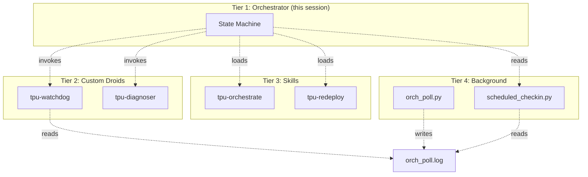
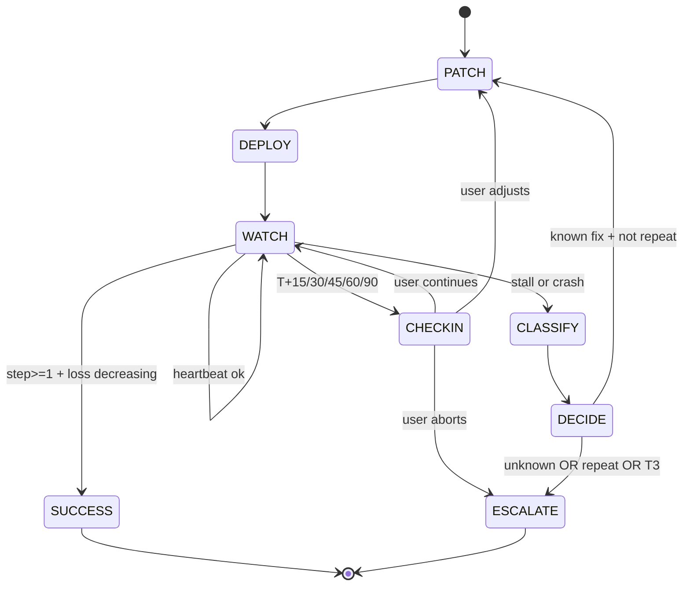
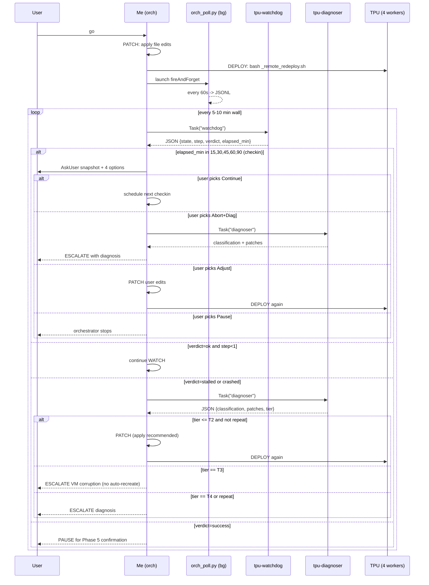
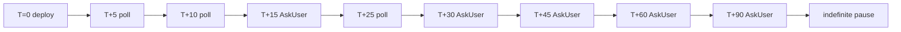
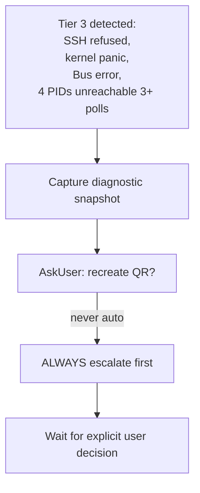

# TPU Canary Self-Healing Orchestrator -- SPEC

## 2026-05-10 control-plane update

This file remains the source of truth for the **self-healing run loop**
(PATCH -> DEPLOY -> WATCH -> CLASSIFY -> DECIDE). TPU throughput
optimization now has its own connected spec:
`TPU_OPTIMIZATION_SPEC.md`.

Read `CONTROL_PLANE.md` first for the unified map of skills, droids,
hooks, memory files, and orchestration specs. The master TPU entry point
is still `tpu-orchestrate`; it selects self-healing mode from this file
or optimization mode from `TPU_OPTIMIZATION_SPEC.md`.

**Version:** v4 control-plane banner (2026-05-10)

## 2026-05-13 update banner

The original SPEC below describes the v4-32 spot canary in
`us-central2-b` (4 hosts, 4 Python processes). Since 2026-05-08 the
active topology has pivoted to **single-host TPU v6e-8 spot in
`europe-west4-a`** (QR `tinyaya-stage2-spot-v6e8-eu-qr`, ONE Python
process driving 8 chips via SPMD). All references to "4 worker
PIDs", multi-host wandb shared-mode rendezvous, and the
`gcloud ssh --worker=all` fan-out should be read with the topology
qualifier: on v6e-8 the watchdog inspects ONE worker PID, ONE tmux
session, ONE wandb run; on legacy v4-32 / future v6e-64 it inspects
4 / 8 (one per host). The state machine, check-in cadence, and
diagnosis table are topology-agnostic and remain the source of
truth.

Iter 24h validated this topology for production: 5000/5000 steps,
W&B run `7rrjupc7`, final loss 5.3558, exit status 0, and canonical
checkpoint
`gs://tinyaya-stage2-tpu/checkpoints/stage2-tpu-v6e-spot/step_005000_final/`.
`opt-prod5k` then validated the optimized production config:
5000/5000 steps, W&B run `kzsijxv5`, final loss 5.105, p50 6.14
s/step, p99 6.76 s/step, exit status 0, and checkpoint
`gs://tinyaya-stage2-tpu/checkpoints/stage2-tpu-v6e-spot-opt-prod5k/step_005000_final/`.
Phase 4 candidates should use the same bounded loop plus
`REPO_TARBALL_GS_URI` for private-repo-safe fresh TPU startup.
Future orchestrator use should treat "canary" language below as the
same bounded self-healing loop applied to production cleanup and
scale-up runs.

**Version:** v4 (2026-05-10)
**Status:** Approved and production-validated on single-host v6e-8 EU
**Branch:** `feat/tpu-support`
**Implementation:** Option B (Skills + Custom Droids hybrid)

---

## 1. Goal

Drive TPU canary or production runs to a known-good compile + decreasing
loss with **bounded autonomous iteration** (legacy v4-32 canary;
current production path is single-host v6e-8 EU). Fix-and-redeploy on
classified errors without re-asking; pause for human only on
(a) success, (b) check-in milestone, or (c) circuit-breaker trip.

## 2. Decisions locked

| Decision | Value | Why |
|---|---|---|
| Folder | `.factory/orchestration/` | Memory-system adjacent |
| Implementation | Option B | Best autonomy/complexity ratio |
| Iteration cap | OPEN (no hard cap) | Replaced by check-ins |
| Wall-time cap | OPEN | Compile time genuinely varies |
| First-step deadline | OPEN | Sharding distribution takes time on FSDPv2-LoRA SPMD |
| Check-in cadence | **15 / 30 / 45 / 60 / 90** min wall | Mandatory `AskUser` |
| Tier 3 (VM corruption) | **Always escalate** (LOCKED) | New QR costs >> human review |

## 3. Architecture (4 tiers)

See `diagrams/01-architecture.mmd`.

## 4. State machine

See `diagrams/02-state-machine.mmd`.

## 5. How the loop runs in practice (concrete sequence)

See `diagrams/03-sequence.mmd`.

## 6. Check-in cadence

See `diagrams/04-checkin-cadence.mmd`.

Each AskUser shows you a structured snapshot (see
`playbook/checkin-protocol.md`) with 4 options:
**Continue / Abort+Diag / Adjust / Pause**.

## 7. Tier 3 (VM corruption) -- locked

See `diagrams/05-tier3-escalation.mmd`.

Topology note: the diagram retains the "4 PIDs unreachable" wording
because it is the diagnostic regex value for the legacy v4-32
multi-host case. On the current single-host v6e-8 EU canary there is
ONE Python PID, so the equivalent is "1 PID unreachable 3+ polls"
(or, equivalently, the single tmux session is gone). On future
v6e-64 multi-host pods it would be 8 PIDs.

## 8. Diagnosis table (excerpt; full table in `playbook/diagnosis-table.md`)

| # | Symptom | Patch | Tier |
|---|---|---|---|
| 1 | `Failed to deserialize executable: UNIMPLEMENTED` | Remove `XLA_PERSISTENT_CACHE_PATH` | T2 |
| 2 | `ValueError.*Layer N has mismatched keys` | `use_scan_layers: false` | T2 |
| 3 | `AssertionError.*FakeTensor.*aten.index_select` | Drop `is_layer_pure=True` | T2 |
| 5 | OOM / exit 137 | Halve batch_size or depth_chunk_size | T2 |
| 6 | TPU duty=0 + HBM>50 + no step in 30 min | Kill + dump met.metrics_report() | T2 |
| 7-9 | SSH refused / kernel panic / N PIDs dead (N=1 on v6e-8, 4 on legacy v4-32, 8 on v6e-64) | ESCALATE (no auto-recreate) | **T3** |
| 10 | Same error twice | ESCALATE | T4 |

## 9. File patches (Phase 1.5)

| File | Change |
|---|---|
| `simultaneous-translation/scripts/tpu/startup_script.sh` | Remove `XLA_PERSISTENT_CACHE_PATH`, drop `while true` loop, add `python -u` |
| `simultaneous-translation/scripts/tpu/_remote_redeploy.sh` | Same XLA cache + loop removals |
| `simultaneous-translation/src/model/scan_utils.py` | Drop `is_layer_pure=True` from scan_layers call site |

YAML configs already done in prior commit (`use_scan_layers: false` everywhere).

## 10. Stop conditions

1. `step >= 1` AND `loss` decreasing -> SUCCESS
2. Same classification twice consecutively -> ESCALATE
3. Tier 3 detected -> ESCALATE (always)
4. User picks Abort/Pause -> ESCALATE / pause
5. Past T+90 wall -> indefinite pause until user resumes

## 11. Verification (Definition of Done)

- [ ] `.factory/orchestration/` folder created with all artifacts
- [ ] 4 implementation files (2 skills, 2 droids) in natural locations
- [ ] poller + checkin script in `_artifacts/`
- [ ] 3 file patches applied
- [ ] Hot redeploy succeeded; new PID(s) confirmed on every worker
  (1 worker on v6e-8 single-host, 4 on legacy v4-32, 8 on v6e-64)
- [ ] Watchdog reports `verdict=success` for 2+ consecutive polls
- [ ] wandb shows `step >= 1` AND >= 3 `loss=` lines AND loss decreasing
- [ ] At least one checkpoint write attempted
- [ ] PROGRESS.md entry written

## 12. Research basis

| Pattern | Source |
|---|---|
| Detect -> Diagnose -> Heal -> Verify (4-phase loop) | Claude Lab "Self-Healing AI Agents" 2026, AgentPatterns.ai |
| Failure-Driven Iteration (paste error -> fix root cause -> re-run) | Claude Code Best Practices, GitHub Copilot CLI |
| Diagnosis-mapping table | Zylos "AI Agent Self-Healing" |
| Tiered recovery (least disruptive first) | Erlang OTP supervisors + K8s liveness/readiness probes |
| Circuit breaker on repeat failures | LangChain GTM Self-Heal April 2026 |
| Bounded loop with check-ins (HUMAN task) | Conductor production agent architecture |
| Stuck detection: action-repetition + progress-plateau | K8s probes |
| Custom droids for context isolation | Factory.ai docs/cli/configuration/custom-droids |
| Skills for encoded playbooks | Factory.ai docs/cli/configuration/skills |
| Hot redeploy via rsync (no QR recreate) | GCP Spot TPU docs |
| XLA cache broken | pytorch/xla #8930, #9094 (both OPEN) |
| scan_layers structure check | torch_xla scan_layers.py source `_ensure_same_structure` |
| FakeTensor index_select | PyTorch #105485 |
