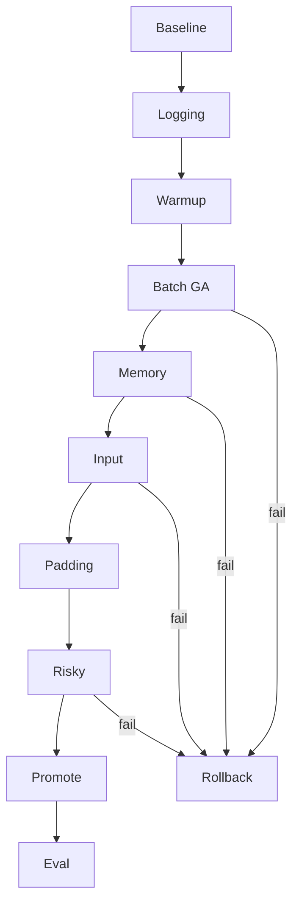

# TPU Training Optimization Orchestration -- SPEC

**Version:** v1 (2026-05-10)
**Status:** Active planning baseline after iter 24h production success
**Branch:** `feat/tpu-support`
**Control plane:** `CONTROL_PLANE.md`

## 1. Goal

Optimize the validated iter 24h single-host TPU v6e-8 training path for
lower wall-clock and better examples/sec while preserving the stability
envelope that completed the first 5000-step production run:

- no NaN, OOM, `RESOURCE_EXHAUSTED`, fatal, traceback, bus error, or
  kernel panic;
- no late XLA recompiles after the warmup window;
- static batch, grad-accum, attention-mask, and epoch-boundary topology;
- comparable matched-step loss and downstream ASR-BLEU/DNSMOS.

Iter 24h remains the canonical fallback checkpoint and baseline:
W&B `7rrjupc7`, final loss `5.3558`, wall `615.9 min`, final
checkpoint
`gs://tinyaya-stage2-tpu/checkpoints/stage2-tpu-v6e-spot/step_005000_final/`.

## 2. Baseline protected config

```yaml
train:
  batch_size: 8
  grad_accum: 4
  max_steps: 5000
  warmup_steps: 200
  depth_chunk_size: 16
  precision: bfloat16
  use_scan_layers: false
  xla_grad_checkpoint: true
  enable_clip_grad_norm: false
  fsdp_barrier_hook: false
data:
  max_frames: 400
logging:
  log_every: 1
  save_every: 0
```

Any optimization candidate must be compared against this baseline and
must preserve the iter 24h safety constraints unless explicitly marked
as an isolated high-risk probe.

## 3. Research basis

Exa research and upstream docs point to these constraints:

| Finding | How it shapes this plan |
|---|---|
| Google TPU performance docs: profile first, keep TPU fed, use the largest batch that fits, and prefer TPU-friendly divisibility. | Start with XProf + metrics, then sweep batch/grad accumulation. |
| Google/PyTorch XLA profiling docs: XProf traces and `xp.Trace()` labels reveal idle time, host/device stalls, and optimizer/logging cost. | Add opt-in trace windows and named sections before changing high-risk knobs. |
| PyTorch/XLA docs: `.item()`/`.cpu()` access and dynamic shapes cause syncs/recompiles. | Reduce logging materialization and keep all candidate graphs static. |
| PyTorch/XLA examples: `MPDeviceLoader` can improve host-to-device feed behavior. | Test it only after profiling shows an input/transfer bottleneck. |
| PyTorch/XLA FSDPv2 and scan docs: FSDPv2 SPMD is the right memory path, while `scan_layers` requires homogeneous structure and purity. | Keep iter 24h FSDPv2 defaults; test `scan_layers` only in isolated probes. |

## 4. Optimization flow

See `diagrams/06-optimization-flow.mmd`.



## 5. Global gates

Every candidate must pass the gates below before promotion:

1. **Compile gate:** all expected graphs compile before counted
   steady-state measurement; no new compile cause after the warmup
   window.
2. **Stability gate:** no NaN, OOM, `RESOURCE_EXHAUSTED`, fatal,
   traceback, bus error, or kernel panic.
3. **Memory gate:** per-chip HBM peak stays below the configured ceiling
   for the experiment. Default ceiling: `<= 29 GiB` on v6e-8 unless the
   runbook explicitly raises it.
4. **Quality gate:** matched-step loss is not materially worse than
   iter 24h, and the promoted checkpoint must pass ASR-BLEU/DNSMOS eval.
5. **Throughput gate:** candidate improves steady-state step time or
   examples/sec enough to justify added complexity.
6. **Rollback gate:** if a candidate fails any gate, revert to the last
   promoted config and log the failure in `PROGRESS.md`.

## 6. Phases

### Phase 0 -- Baseline measurement harness

Purpose: measure before changing training behavior.

Steps:

1. Extract iter 24h metrics from W&B/logs:
   - compile duration;
   - p50/p90/p99 steady step time;
   - examples/sec;
   - frame-tokens/sec;
   - HBM peak and allocation;
   - compile-cause count;
   - loss at matched steps.
2. Add opt-in perf instrumentation guarded by config:
   - `perf/examples_per_sec`;
   - `perf/frame_tokens_per_sec`;
   - `perf/effective_batch`;
   - `perf/log_interval_sec`;
   - `perf/compile_cause_delta` if available.
3. Add optional XProf trace windows with labels:
   - `data_fetch`;
   - `device_transfer`;
   - `forward_loss`;
   - `backward`;
   - `mark_step`;
   - `optimizer_step`;
   - `logging_materialize`.
4. Keep default behavior unchanged when instrumentation flags are off.

Promotion: instrumentation is present, off by default, and emits stable
metrics in a short TPU smoke run.

### Phase 1 -- Low-risk sync/logging optimization

Purpose: reduce host syncs caused by per-step materialization.

Candidate sequence:

1. Change experiment config to `log_every=10`.
2. If stable, test `log_every=25`.
3. Keep XLA accumulators on-device and materialize only at log
   boundaries.

Promotion: W&B remains useful and p50 step time improves without losing
failure visibility.

### Phase 2 -- Compile warmup before visible step 1

Purpose: move optimizer-state and training-step compilation before the
first counted step.

Implementation outline:

1. Add opt-in `train.compile_warmup_steps: 1`.
2. Run one static-shape macro-step with the same `batch_size`,
   `grad_accum`, `max_frames`, masks, backward path, and optimizer-step
   graph as real training.
3. Temporarily set optimizer LR and weight decay to zero.
4. Initialize optimizer state, then reset AdamW moment tensors and step
   counters to zero.
5. Assert weights are unchanged before counted training.

Promotion: visible `step 1` is steady-state, no warmup weight drift, and
the 300-step loss curve matches baseline.

### Phase 3 -- Batch/grad-accum sweep at fixed effective batch

Purpose: reduce micro-step count per optimizer step while preserving
effective batch size 256.

Candidate order:

| Candidate | Effective batch | Risk |
|---|---:|---|
| `b=8, g=4` | 256 | baseline |
| `b=16, g=2` | 256 | medium; prior b=16 hit step-259 failure before iter 24h topology fix |
| `b=32, g=1` | 256 | high; only after b=16 passes with HBM headroom |

Each candidate must pass:

1. 20-step smoke run.
2. 300-step stability run crossing historical failure boundaries.
3. No late recompile after warmup.
4. HBM ceiling.
5. Matched-step loss parity.

Promotion: lowest steady-state p50 step time among candidates that pass
all gates.

### Phase 4 -- Activation and depth-chunk sweep

Purpose: determine whether activation checkpoint recompute and depth
chunk overhead are still worth the memory savings.

Candidate sequence:

1. Test `xla_grad_checkpoint=false` on the best Phase 3 batch candidate.
2. Test `depth_chunk_size=32`.
3. Test `depth_chunk_size=64` only if HBM remains safe.

Promotion: throughput improves and HBM/loss gates pass. Keep
`xla_grad_checkpoint=true` and `depth_chunk_size=16` if larger candidates
regress or OOM.

### Phase 5 -- Input pipeline and transfer profiling

Purpose: avoid TPU idle gaps.

Steps:

1. Use XProf to check host/device idle time and data-transfer gaps.
2. If input-bound, add opt-in `MPDeviceLoader`/prefetch integration with
   static-shape assertions.
3. Sweep `num_workers` values such as `4` and `8`.
4. Consider TPU premapped-buffer tuning only if runtime logs show buffer
   pressure.

Promotion: XProf shows reduced idle/transfer gaps and throughput improves
without graph churn.

### Phase 6 -- Static bucketing and padding optimization

Purpose: reduce padding waste without reintroducing dynamic topology.

Steps:

1. Quantify padding waste at `max_frames=400`.
2. If waste is material, introduce static buckets such as `200/300/400`.
3. Prewarm every bucket graph before counted training.
4. Switch buckets only at macro-step boundaries.

Promotion: padding waste and wall-clock improve, all bucket graphs are
precompiled, and no late compile appears.

### Phase 7 -- Isolated high-risk experiments

Purpose: test potentially valuable but historically risky features away
from the production path.

Candidate probes:

1. `scan_layers` after resolving heterogeneous LoRA/full-FT structure.
2. FSDPv2 wrap variants that avoid per-layer `Cohere2DecoderLayer`
   reduce-scatter NaNs.
3. Flash attention A/B.
4. Syncfree optimizer or optimizer alternatives if XProf shows optimizer
   sync dominates.

Promotion: requires isolated smoke, 300-step stability, no NaNs, and
loss parity. These knobs never bypass the standard gates.

### Phase 8 -- Promotion run and evaluation

Purpose: prove the optimized config is better end-to-end.

Steps:

1. Select the best passing candidate.
2. Run a 1000-step validation training pass.
3. If stable, run a full 5000-step production pass.
4. Run `eval_stage2.py` on the resulting checkpoint.
5. Compare ASR-BLEU/DNSMOS, loss curve, wall-clock, and checkpoint
   integrity against iter 24h.

Promotion: full 5000-step pass and eval beat or match iter 24h quality
while improving wall-clock or throughput.

## 7. Experiment record format

Each optimization run should create a compact record in `PROGRESS.md`
and, only if durable, a decision in `memories.md`.

```text
candidate: opt-<phase>-<short-knob>
base: iter24h
config_diff: <one-line diff>
run_id: <wandb-id>
run_length: <20|300|1000|5000 steps>
result: pass|fail|rollback|promote
metrics: p50_step_time=<s>, examples_sec=<n>, hbm_peak=<GiB>, compile_delta=<n>
decision: <why promoted or rejected>
```

## 8. Stop conditions

Stop the current candidate and roll back if any occur:

- non-finite loss or gradients;
- OOM or `RESOURCE_EXHAUSTED`;
- late recompile after warmup/precompile;
- warmup weight drift;
- HBM above ceiling;
- checkpoint save failure;
- W&B/logging loss visibility broken;
- loss materially worse than iter 24h at matched steps;
- `tpu-diagnoser` returns T3/T4.

## 9. Required memory updates

- `PLAN.md`: phase checklist and current active candidate.
- `PROGRESS.md`: every run event, pass/fail, rollback, and verification.
- `memories.md`: durable architecture decisions, promoted configs, and
  gotchas only.
- `.factory/orchestration/`: operational spec/playbook updates.
- `_artifacts/`: raw profiles, logs, and ephemeral state; not a source
  of truth.
