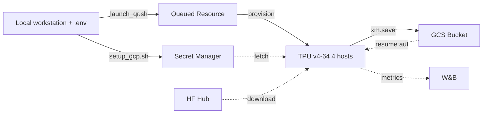
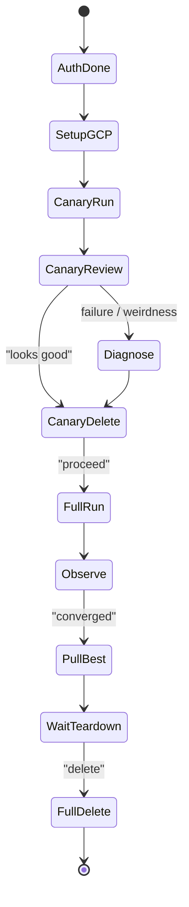
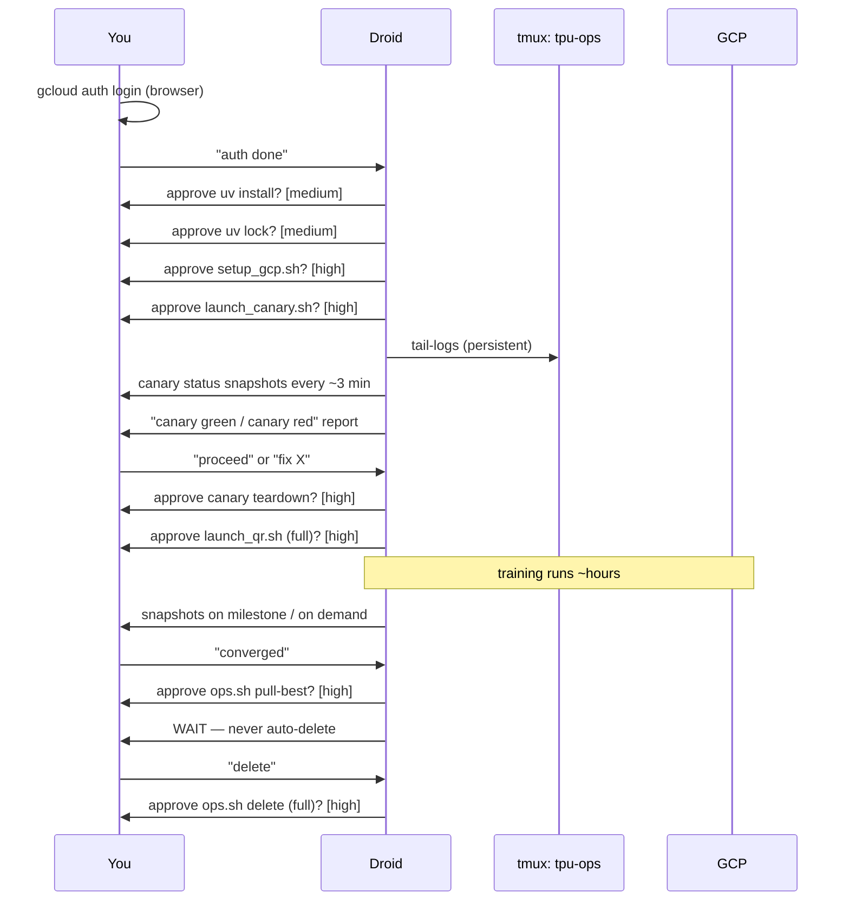

# TPU v4 Launch Plan — Stage 2 TR↔HI

## 2026-05-13 update

The historical narrative below assumes TPU v4-64 / v4-32 in
`us-central2-b` as the launch target. The validated production
topology has since pivoted to **single-host TPU v6e-8 spot in
`europe-west4-a`**
(QR `tinyaya-stage2-spot-v6e8-eu-qr`, node
`tinyaya-stage2-spot-v6e8-eu`, optimized production config
`configs/stage2_tpu_v6e_spot_opt_prod5k.yaml`, profile shorthand
`v6e-8-eu`). On v6e-8 there is exactly one host with 8 chips and
ONE Python process driving them via SPMD -- no multi-host
coordination required. Iter 24h completed the first 5000-step
production run on this topology: W&B run
[`7rrjupc7`](https://wandb.ai/cataluna84/tinyaya-stage2-tpu/runs/7rrjupc7),
5000/5000 steps in 615.9 min, final loss 5.3558, exit status 0, and
canonical checkpoint
`gs://tinyaya-stage2-tpu/checkpoints/stage2-tpu-v6e-spot/step_005000_final/`
(8 objects, 2.37 GiB). `opt-prod5k` then completed the optimized
5000-step production pass: W&B
[`kzsijxv5`](https://wandb.ai/cataluna84/tinyaya-stage2-tpu/runs/kzsijxv5),
final loss 5.105, p50 6.14 s/step, p99 6.76 s/step, wall 562 min,
checkpoint
`gs://tinyaya-stage2-tpu/checkpoints/stage2-tpu-v6e-spot-opt-prod5k/step_005000_final/`.
Phase 4 started with `opt-4-depth32` (W&B
[`i15igq8d`](https://wandb.ai/cataluna84/tinyaya-stage2-tpu/runs/i15igq8d),
300/300 steps, exit 0, p50 5.296 s/step, p99 5.725 s/step)
using the GCS repo tarball startup path (`REPO_TARBALL_GS_URI`) to
avoid private GitHub clone credentials on fresh TPU VMs. v4-32 spot is
legacy and v6e-64 in `europe-west4-a` is the next multi-host scale-up
target. **Sections
below referring to a v4-64 4-host topology, the v4-32 spot fallback,
or `us-central2-b`-specific behaviour are historical** and preserved
for the planning context that produced the launch infrastructure.

**Status:** Approved 2026-05-03 (historical); production validated on
v6e-8 EU as of 2026-05-10.
**Branch:** `feat/tpu-support`
**Owner:** Mayank Bhaskar ([@cataluna84](https://github.com/cataluna84), mayankbhaskar007@gmail.com)
**Hardware:** Google Cloud TPU v4-64 (32 chips), donated by TRC
(historical baseline; current production path runs on v6e-8 EU).

This document captures the proposal that produced the launch infrastructure
under `simultaneous-translation/scripts/tpu/`, the `pyproject.toml` /
`uv.lock` at the repo's training root, and the changes to
`configs/stage2_tpu.yaml`. It is intended as an architecture record so
future contributors can understand the choices behind the setup.

---

## 1. Goal

Train and fine-tune the TinyAya Stage 2 hierarchical Cohere2 + Mimi model
on Google Cloud TPU v4 hardware using the TPU Research Cloud (TRC) free
allocation, with a reproducible, restart-tolerant launch path.

## 2. Allocation summary (TRC)

> **SUPERSEDED 2026-05-05.** The table previously in this section was
> a draft. The authoritative TRC allocation -- captured verbatim from
> the welcome email sent by `trc-support@google.com` -- now lives at
> [`docs/tpu-trc-allocation.md`](./tpu-trc-allocation.md). Refer to
> that file for the current quotas, zones, and tiers. The historical
> notes below are retained for context only.

Historical (May 2026 draft, do not rely on):

- TPU v4 chips, 32, `us-central2-b`, on-demand.
- v3, v2, v5litepod-8, v6e-1 preemptible slices listed but
  superseded by the email-confirmed grant in
  `docs/tpu-trc-allocation.md`.

We use the **on-demand v4 quota** when available, and fall back to
the **spot v4-32 in the same zone** (`us-central2-b`) per the
recommendation in the TRC welcome email. See `tpu-trc-allocation.md`
§3 for the full decision tree.

**GCP project:** `ml-pipelines-315702`.

## 3. Selected configuration

| Field | Value | Rationale |
|---|---|---|
| TPU type | `v4-64` (32 chips, 4 hosts × 4 chips, 32 GiB HBM/chip) | Maps the 32 v4 chips to the smallest single-slice topology |
| Tier | on-demand | TRC granted on-demand for v4; avoids preemption mid-training |
| Zone | `us-central2-b` | Only zone with on-demand v4 quota in our grant |
| Runtime image | `tpu-ubuntu2204-base` | Current official base image for v4 (Ubuntu 22.04 + drivers); v4 has no framework-bundled image |
| Package manager | **`uv`** | 10–100× faster than pip; bundles its own Python; clean lockfile workflow |
| Python | **3.12.13** | EOL Oct 2028; PEP 709 perf wins; aligns with `r2.8.0_3.12_tpuvm` Docker; 3.10 EOLs Oct 2026 |
| torch / torch_xla | **2.9.0** (Nov 17, 2025) | Latest stable; C++11 ABI default; pinned `libtpu`; no 2.10 has been released |
| Reproducibility | `pyproject.toml` + `uv.lock` (committed) | Identical resolution across all 4 hosts and re-launches |
| Provisioning | Queued Resource API | TRC requires QR for v4; supports auto-restart loop |
| Data | HF Hub → `/mnt/data` at boot | `tiny-aya-translate/fleurs-tr-hi-mimi-encoded`, ~few GB |
| Secrets | GCP Secret Manager | Seeded once from local `.env`; pulled by VMs at boot |
| Checkpoints | `gs://tinyaya-stage2-tpu/checkpoints/stage2-tpu` | Already supported by `src/training/checkpointing.py` |

## 4. Architecture



The `feat/tpu-support` branch already provides the runtime pieces:
- `src/backends/tpu_backend.py` — SPMD + FSDPv2 backend abstraction
- `src/training/checkpointing.py` — `gs://` save/load via `gcsfs`
- XLA-safe gradient checkpointing in `src/model/composite.py`
- `use_cache=False` for sliding-window XLA compatibility

This plan adds **launch infrastructure only**; no source code changes.

## 5. Decision log (how we got here)

These are the decisions that shaped the final spec, in the order they
were debated. Each "→" is an answer to a clarifying question.

### 5.1 TPU + zone
- Q: v3 preemptible vs v4 on-demand?
- → **v4-64 on-demand in `us-central2-b`** — no preemption interruptions; 32 GiB HBM/chip vs v3's 16 GiB gives more room for FSDPv2 sharding margin.

### 5.2 Data staging
- Q: bake into a custom TPU image, pre-stage to GCS, or HF download per boot?
- → **HF Hub download per boot** — small dataset, simplest, tolerates re-provisioning.

### 5.3 Preemption / restart
- Q: Provision tool?
- → **Queued Resource + tmux restart loop + `--resume auto`** — even on-demand v4 can fail; the restart loop survives crashes, OOMs, and host reboots automatically.

### 5.4 Secrets
- Q: Where do `HF_TOKEN` / `WANDB_API_KEY` live?
- → **GCP Secret Manager**, seeded from local `.env`. VMs never see `.env`.

### 5.5 Versions (revisited 3×)
- Initial proposal: torch_xla 2.6, Python 3.10, pip.
- Revision 1: → torch_xla **2.9.0** (latest stable, Nov 2025). C++11 ABI is default, libtpu is stable-pinned.
- Revision 2: → **`uv`** instead of pip (faster on ephemeral VMs; manages its own Python; better resolver).
- Revision 3: → **Python 3.12.13** (3.10 EOLs in 6 months; 3.12 has measurable speedups; aligns with Google's official `r2.8.0_3.12_tpuvm` Docker).
- Revision 4: → **`pyproject.toml` + `uv.lock`** (full reproducibility; replaces ad-hoc `requirements-tpu.txt`).

### 5.6 Boundaries
- I (Droid) create files only. The user runs every `gcloud` and `uv` command from their workstation. No remote state is touched by the agent.

## 6. Files created / modified

All paths under `simultaneous-translation/` unless noted.

| File | Action | Purpose |
|---|---|---|
| `pyproject.toml` | new | Project metadata + pinned deps + uv config |
| `uv.lock` | generated by user via `uv lock` | Frozen dependency graph |
| `configs/stage2_tpu.yaml` | modify | `gs://` save dir, `/mnt/data` paths, `num_workers: 4`, run name |
| `scripts/tpu/startup_script.sh` | new | Idempotent VM bootstrap (uv, repo, deps, secrets, data, train loop) |
| `scripts/tpu/setup_gcp.sh` | new | One-time: bucket + secrets + IAM, reads root `.env` |
| `scripts/tpu/launch_qr.sh` | new | Creates Queued Resource for `v4-64` on-demand |
| `scripts/tpu/ops.sh` | new | Daily ops: `status`, `tail-logs`, `pull-best`, `delete` |
| `scripts/tpu/README.md` | new | Ops cheat sheet |
| `/.gitignore` (root) | new | Ignore `.env`, `.venv/`, `__pycache__/`, `*.pyc` |

## 7. Why each version

| Pkg | Pin | Reason |
|---|---|---|
| Python | 3.12.13 | EOL Oct 2028; PEP 709 inlined comprehensions; faster `__getitem__` loops; aligns with TPU Docker |
| `torch` | `2.9.0` | Matches torch_xla; no 2.10 release exists |
| `torch-xla[tpu]` | `2.9.0` | Latest stable Nov 2025; C++11 ABI default; `libtpu` pinned |
| `transformers` | `>=4.45,<4.50` | Cohere2 + Mimi already supported; cap to avoid breakage |
| `peft` | `>=0.13,<0.16` | LoRA API stable in this range |
| `accelerate` | `>=1.0,<2.0` | Used incidentally by HF stack |
| `numpy` | `<2.0` | torch_xla 2.9 not yet validated against numpy 2.x for TPU |
| `gcsfs` | `>=2024.10.0` | `gs://` paths in `checkpointing.py` |

## 8. Operations sequence

```mermaid
sequenceDiagram
  participant You
  participant Local
  participant GCP
  participant TPU
  You->>Local: uv lock; git add ...; git push
  You->>GCP: setup_gcp.sh (bucket, secrets, IAM)
  You->>GCP: launch_qr.sh (creates QR)
  GCP->>TPU: provision + run startup_script
  TPU->>TPU: install uv; py3.12.13; uv sync --frozen
  TPU->>GCP: secrets fetch
  TPU->>TPU: HF download to /mnt/data
  TPU->>GCP: ckpt every 500 steps to GCS
  Note over TPU,GCP: ~5000 steps
  You->>GCP: ops.sh pull-best
  You->>GCP: ops.sh delete
```

## 9. Commands the operator runs

In order, from the repo root:

```bash
# one-time uv install
curl -LsSf https://astral.sh/uv/install.sh | sh

# generate / refresh lockfile
cd simultaneous-translation
uv lock
uv lock --check          # sanity

# commit everything
cd ..
git add simultaneous-translation/pyproject.toml \
        simultaneous-translation/uv.lock \
        simultaneous-translation/configs/stage2_tpu.yaml \
        simultaneous-translation/scripts/tpu/ \
        simultaneous-translation/docs/tpu-launch-plan.md \
        .gitignore
git commit -m "feat: TPU v4-64 launch infra (uv + py3.12.13 + torch_xla 2.9)"
git push origin feat/tpu-support

# gcloud auth (one-time)
gcloud auth login
gcloud auth application-default login
gcloud config set project ml-pipelines-315702

# seed GCP (bucket, secrets, IAM)
bash simultaneous-translation/scripts/tpu/setup_gcp.sh

# launch
bash simultaneous-translation/scripts/tpu/launch_qr.sh

# observe
bash simultaneous-translation/scripts/tpu/ops.sh status
bash simultaneous-translation/scripts/tpu/ops.sh tail-logs

# finish
bash simultaneous-translation/scripts/tpu/ops.sh pull-best
bash simultaneous-translation/scripts/tpu/ops.sh delete
```

## 10. Known risks (acknowledged, not blocking)

1. **Multi-host FSDPv2 unverified on v4.** The backend has only run on a
   Colab v5e-1 single-host. We mitigate by canary-running 200 steps before
   committing to the full 5,000.
2. **`auto_wrap_policy` class names** in `tpu_backend.py` reference
   `CohereDecoderLayer` / `MoshiDecoderLayer`. The actual transformers
   class for Cohere2 is likely `Cohere2DecoderLayer`. Patch on first
   failure (one-line edit).
3. **HF download rate-limit** when 4 hosts pull in parallel. Fallback:
   pre-stage to GCS once and switch the startup script to `gcloud storage
   rsync`.
4. **`uv` install requires internet.** If `astral.sh` is unreachable at
   boot, fallback path: `pip install uv` (already on the base image),
   then re-exec.
5. **TRC sharing obligation.** Outputs (paper, blog, OSS) must
   acknowledge the TPU Research Cloud per the grant terms.
6. **`scan_layers` TypeError on torch_xla 2.9 -> 4h+ compile.**
   Observed 2026-05-05 on a v4-32 spot canary: every scan call raised
   `TypeError("scan_layers() got an unexpected keyword argument
   'attention_mask'")` because the wrapper in
   `src/model/scan_utils.py::_FusedScanLayer.forward` passes HF
   kwargs to `scan_layers`, which in torch_xla 2.9 only accepts
   `(layers, input_data, partition_fn=..., is_layer_pure=...)`. The
   manual-loop fallback then unrolled 36+6 = 42 decoder layers into
   the HLO and the backward compile took **4h 25min** wall instead
   of the documented 25-min budget. Fix is drafted in
   `.factory/memories.md` 2026-05-05 "scan_layers TypeError"
   (`_KwargBoundLayer` closure pattern). Until applied, do **not**
   budget less than 5h wall time for the first canary compile.
7. **No persistent XLA cache configured.** When the training process
   dies (spot preemption, OOM-kill, supervisor timeout), the
   `startup_script.sh` while-loop restarts it but XLA tracing starts
   from scratch because `XLA_PERSISTENT_CACHE_PATH` is unset. Every
   restart pays the full compile tax. Fix is in
   `.factory/memories.md` 2026-05-05 "XLA compile cache must be
   configured".
8. **HF dataset is packed-in-tarballs, not loose files.** The
   `tiny-aya-translate/fleurs-tr-hi-mimi-encoded` dataset publishes
   `packed/encoded_pt.tar.gz` and `packed/encoded_alignments.tar.gz`,
   each containing a top-level `encoded/` directory. They must be
   extracted with `tar -xzf ... --strip-components=1 -C
   $DATA_DIR/encoded`. The `startup_script.sh` extraction block was
   added 2026-05-05; before that fix the dataset code crashed with
   `FileNotFoundError` because `_resolve` could not find `.pt` files
   under the configured `encoded_dir`.
9. **GCS `find_latest_checkpoint` raised on first run.** Original
   code in `src/training/checkpointing.py::get_checkpoint_dirs`
   called `gcsfs.GCSFileSystem().ls(base_dir)` without catching
   `FileNotFoundError`, so `--resume auto` would crash on the very
   first run when the prefix does not exist yet. Patched
   2026-05-05 to catch and return `[]`.
10. **Regional `IN_USE_ADDRESSES` quota = 8.** Every TRC region we
    have TPU quota in caps external IPs at 8. v5e-64 and v6e-64 are
    8-host slices needing 8 external IPs, so they fail in
    `PROVISIONING -> SUSPENDING -> FAILED` even when TPU quota is
    fine. v4-32 (4 hosts) and v4-64 (4 hosts on v4) fit under the
    cap. See `docs/tpu-capacity-log.md` section 7.1 for workarounds
    (`INTERNAL_IPS=1`, GCP quota bump, or pick a 4-host slice).

## 11. Out of scope (future work)

- Async `CheckpointManager` migration (currently synchronous via `xm.save`)
- Multislice scaling (would require GCS staging + a coordinator)
- v6e / v5e fallback paths
- Spot preemption handling (not needed for on-demand v4)
- Adding repo-wide `pyproject.toml` (this one covers training only)

## 12. Live observation (tmux on the worker)

`startup_script.sh` runs training inside `tmux new-session -d -s
train ...`, owned by root. Every TPU worker therefore has an
already-running tmux session named `train` that captures the
supervisor loop and the live training stdout/stderr.

**Interactive attach** (your terminal becomes the tmux client):

```bash
gcloud compute tpus tpu-vm ssh <node> \
    --project=ml-pipelines-315702 --zone=<zone> \
    --worker=0 \
    -- -t 'sudo tmux attach -t train'
```

The `-- -t` is required so gcloud allocates a TTY. Detach with
`Ctrl-b d` -- this leaves the session running.

**Read-only attach** (cannot accidentally type into the live process):

```bash
gcloud compute tpus tpu-vm ssh <node> \
    --project=ml-pipelines-315702 --zone=<zone> \
    --worker=0 \
    -- -t 'sudo tmux attach -t train -r'
```

**Non-interactive scrollback dump** (preferred for status checks
inside scripts and droid sessions):

```bash
gcloud compute tpus tpu-vm ssh <node> \
    --project=ml-pipelines-315702 --zone=<zone> \
    --worker=0 \
    --command='sudo tmux capture-pane -t train -p | tail -80'
```

**Tail `/tmp/train.log` directly** (equivalent for many cases):

```bash
gcloud compute tpus tpu-vm ssh <node> \
    --project=ml-pipelines-315702 --zone=<zone> \
    --worker=0 \
    -- -t 'sudo tail -F /tmp/train.log'
```

Notes:
- Multiple clients can attach to the same tmux session
  concurrently without disturbing each other.
- The session belongs to root because `startup-script` always runs
  as root; every command above needs `sudo`.
- Worker 0 is sufficient: SPMD means the training output is
  identical across all 4 hosts of a v4-32. If you need worker N,
  swap `--worker=0` for `--worker=N`.
- The session name is configurable via the `TMUX_SESSION` env var
  in `startup_script.sh`; default is `train`.

---

# Addendum A — Execution plan with canary + explicit teardown

**Approved:** 2026-05-03 (second-pass refinement)

This addendum captures the runbook decisions made after the original plan was
approved. It governs how the launch is actually performed in this session.

## A.1 Decisions

| Aspect | Decision |
|---|---|
| Canary | **yes** — 200 steps on `v4-64`, separate QR, separate GCS checkpoint prefix |
| Teardown | **never automatic** — `ops.sh delete` runs only on explicit operator command |
| Commits / push | **never** during the experiment session — operator handles at the end |

## A.2 Canary mechanism — separate QR, no shared state

Two QRs in series, not in parallel; the canary always finishes (or is torn
down) before the full run starts.



## A.3 New / modified files

| File | Action | Purpose |
|---|---|---|
| `configs/stage2_tpu_canary.yaml` | new | 200 steps, frequent save / val / log, separate `save_dir` |
| `scripts/tpu/startup_script.sh` | modify | read `CONFIG_FILE` from VM metadata; default = full config |
| `scripts/tpu/launch_qr.sh` | modify | accept `CONFIG_FILE` env var; pass via `--metadata=config-file=...` |
| `scripts/tpu/launch_canary.sh` | new | thin wrapper that exec's `launch_qr.sh` with canary defaults |
| `.env` (root) | modify | add `PROJECT_ID`, `ZONE`, `BUCKET`, `QR_NAME`, etc. |

### A.3.1 Canary YAML — key deltas vs full config
```yaml
train:
  max_steps: 200
  warmup_steps: 50
logging:
  log_every: 10
  save_every: 50           # exercise save loop ~3-4 times
  val_every: 100           # exercise val once
  audio_every: 100         # exercise Mimi decode for audio sample
  save_dir: gs://tinyaya-stage2-tpu/checkpoints/canary
  wandb_run_name: v4-64-canary
```

### A.3.2 startup_script.sh — config injection point
```bash
CONFIG_FILE="$(curl -fsS -H 'Metadata-Flavor: Google' \
  http://metadata.google.internal/computeMetadata/v1/instance/attributes/config-file \
  2>/dev/null || echo 'configs/stage2_tpu.yaml')"

# ... later in the tmux loop:
uv run python scripts/train_hierarchical.py --config "$CONFIG_FILE" --resume auto
```

### A.3.3 launch_qr.sh — new metadata flag
```bash
CONFIG_FILE="${CONFIG_FILE:-configs/stage2_tpu.yaml}"

gcloud compute tpus queued-resources create "$QR_NAME" \
    ...existing flags... \
    --metadata-from-file=startup-script="$STARTUP_SCRIPT" \
    --metadata="config-file=$CONFIG_FILE"
```

### A.3.4 launch_canary.sh
```bash
#!/bin/bash
set -euo pipefail
SCRIPT_DIR="$(cd "$(dirname "${BASH_SOURCE[0]}")" && pwd)"
exec env \
    QR_NAME="${QR_NAME:-tinyaya-stage2-canary-qr}" \
    NODE_ID="${NODE_ID:-tinyaya-stage2-canary}" \
    CONFIG_FILE="${CONFIG_FILE:-configs/stage2_tpu_canary.yaml}" \
    bash "$SCRIPT_DIR/launch_qr.sh"
```

`ops.sh` needs no change — it already honors `QR_NAME` / `NODE_ID` env
overrides, so canary teardown is:
```bash
QR_NAME=tinyaya-stage2-canary-qr NODE_ID=tinyaya-stage2-canary \
  bash scripts/tpu/ops.sh delete
```

## A.4 Canary success criteria

All seven must be green before the full run starts:

1. QR transitions `WAITING_FOR_RESOURCES → ACTIVE` within ~10 min
2. `tpu-info` on at least one host reports 4 chips
3. `train.log` shows step counters incrementing on **all 4 hosts**
4. At least one checkpoint lands in `gs://tinyaya-stage2-tpu/checkpoints/canary/`
5. At least one validation pass logs to W&B
6. `train.log` shows clean exit at step 200 (not OOM, not assertion error)
7. `auto_wrap_policy` matched ≥1 layer (no "wrapping 0 modules" warning)

If any criterion fails, the operator diagnoses, applies a fix, and
re-launches the canary. The full run does not start until all 7 are green.

## A.5 Approval gating



≈ 9 explicit prompts for the whole run, not counting read-only status /
log captures.

## A.6 Hard constraints

- No `git commit`, `git add`, or `git push` during the experiment session.
- No `ops.sh delete` (canary or full) without explicit operator command.
- No full-run launch unless all 7 canary criteria are green or operator
  overrides.
- No source-file edits in `src/` unless the canary fails on a
  class-name mismatch (and only after operator approval).

## A.7 What the operator runs interactively

Only the browser-OAuth flow:
```bash
gcloud auth login
gcloud auth application-default login
```

Everything else is gated through the per-command `[medium]`/`[high]` risk
prompts in the agent's Execute calls.
